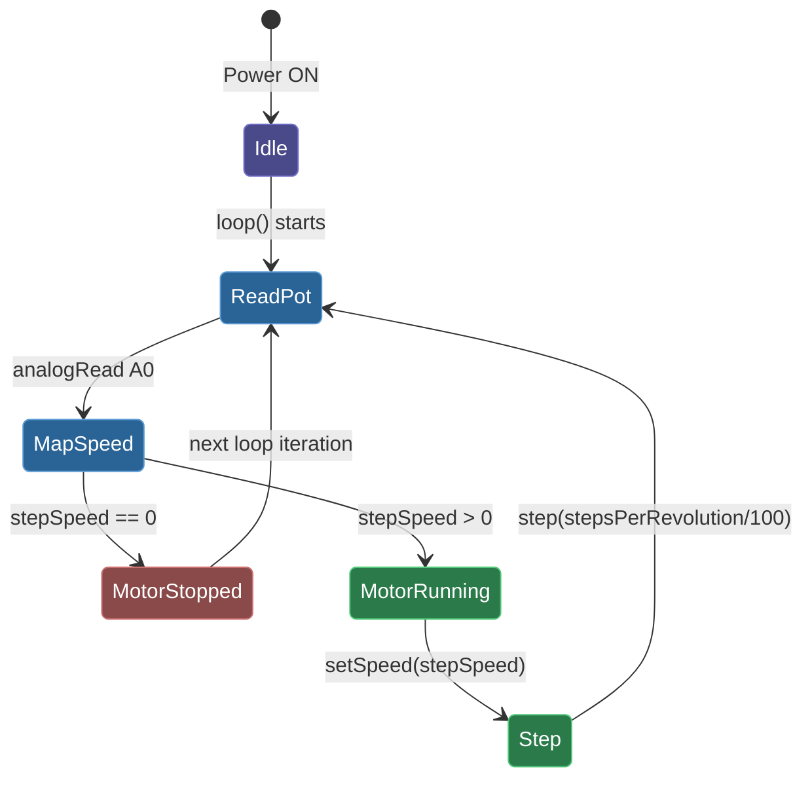

# Motor Speed Control with Potentiometer

Control a **28BYJ-48 stepper motor** speed in real-time using a potentiometer and an Arduino.

---

## Video Demo

[](https://youtube.com/shorts/4chLdcQXoPo?si=oOZAdn1soYZdYY7l)

---

## Project Explanation

This project demonstrates how to use an analog potentiometer to dynamically control the rotational speed of a 28BYJ-48 stepper motor driven by a ULN2003 driver board.

Turning the potentiometer knob maps the analog voltage (0–5V) to a speed range for the stepper motor. When the potentiometer is at zero (or near-zero), the motor stops. As you turn it up, the motor spins faster.

---

## What I Learned

- **Stepper vs DC motors**: Unlike DC motors that spin freely with voltage, 
  stepper motors move in discrete steps (2048 steps per revolution for the 
  28BYJ-48). This requires precise pulse sequencing across 4 coils — the 
  ULN2003 driver handles the current amplification since Arduino pins 
  can't drive the coils directly.

- **Analog-to-digital conversion**: The potentiometer creates a variable 
  voltage (0-5V) that Arduino's 10-bit ADC converts to a digital value 
  (0-1023). I then map this to the motor's usable RPM range (0-17 RPM).

- **Why stepper motors matter in automation**: Stepper motors are used in 
  CNC machines, 3D printers, and robotic positioning systems because of 
  their precise position control — the same principles covered in 
  industrial automation and control systems.

## Hardware

| Component | Details |
|---|---|
| Microcontroller | Arduino Uno  |
| Stepper Motor | 28BYJ-48 (5V) |
| Driver Board | ULN2003 |
| Potentiometer | 10kΩ |

### Wiring

| Arduino Pin | Connected To |
|---|---|
| A0 | Potentiometer middle pin |
| 8 | ULN2003 IN1 |
| 9 | ULN2003 IN2 |
| 10 | ULN2003 IN3 |
| 11 | ULN2003 IN4 |
| 5V / GND | Pot ends + ULN2003 power |

---

## Pseudo Code

```
INCLUDE Stepper library

SET potPin = A0
SET stepsPerRevolution = 2048   // full rotation for 28BYJ-48

INIT stepper on pins 8, 10, 9, 11

LOOP forever:
    READ analog value from potPin  (0 – 1023)

    MAP analog value → stepSpeed   (0 – 17 RPM)

    IF stepSpeed > 0:
        SET motor speed = stepSpeed
        MOVE motor forward by (stepsPerRevolution / 100) steps
```

---

## State Diagram




### State Legend

| Color | State | Meaning |
|---|---|---|
|  Purple | Idle | Arduino powered, waiting for first loop |
|  Blue | Read / Map | Reading potentiometer and computing speed |
|  Red | Motor Stopped | Speed is zero — motor holds position |
|  Green | Motor Running | Motor spinning at mapped speed |

---

## Dependencies

- Arduino built-in **Stepper** library
